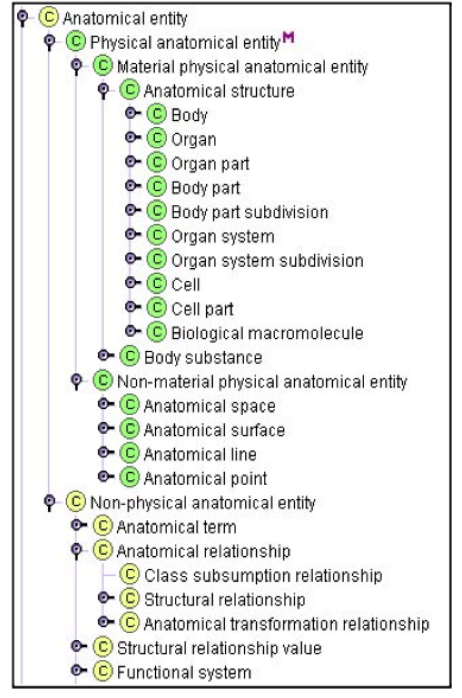

## What is Ontology

As a branch of philosophy, ontology is the science of what is, the kinds and structures of objects, properties, events, processes and relations in every area in reality. Ontology include set of _concepts_ and _relations_. It is knowledge about general propositions that are true of concepts. It means that ontology not concerned with indiviudal things (such as hotels, room) rather than focusing on the definitions of concepts. It is usually resulting in computer implementation. Ontology can be defined informally or using ideas from set theory and logic.

Ontology is useful because it can be used to communicated between _people_. Technical terms are often used with different meaning by different groups in an organization, e.g."Supplier". Ontology can be used to communicated between _computers_. e.g. &lt;cost&gt;£10&lt;/cost&gt; v.s. &lt;price&gt;£10&lt;price&gt;. Ontology can be used to communicated between _people and computers_, e.g. how to read friend (Ann, Bob). The main **benefit** of ontology is improving interoperatbility. Ontology can be drectly transferred from one software application to another without needing prior knowledge of eiter application. The whol progress is aotumatic and maintained the meaninig of all the data values transferred.

This is one of the **example**: a medical ontology. This ontology include Hierarchical organisation of _classes_ and different levels of _granularity_. The attributes (physical and material) distinguish the major branches of the exonomy. 


## Ontological Modelling

Ontological modelling include **concepts, instances, relationships and Functions.** Concepts include class, category and type. The concrete entities(individual) can be instantiated a concept. Assertions about individuals would be considered part of knowledge base, not part of ontology. E.g. 
- Ontology Base: &forall;x x \in Female &rArr; x &notin; Male
- Knowledge Base: Ann &in; Woman &wedge; married (Ann, Joe)
Relationships include N-ary [predicates](https://www.quora.com/What-is-an-ontological-predicate)(unary, binary, tenary, ...).
The unary predicates can be man(Adam) are typically modelled as Concepts: 
Man
Adam &in; Man; Adam &in; Male; Adam &in; Human.
But the analysisi will often reduce relationship to be binary hasMonther(Adam, Ann). The Exception can be between(door, table, window)


```markdown
Question:
- ontology how to coomunication between computers (what is ontology)?
- What is the exception of the Ontology (relationships in ontological modelling)?

# Header 1
## Header 2
### Header 3

- Bulleted
- List

1. Numbered
2. List

**Bold** and _Italic_ and `Code` text

[Link](url) and 
```

For more details see [GitHub Flavored Markdown](https://guides.github.com/features/mastering-markdown/).

### Jekyll Themes

Your Pages site will use the layout and styles from the Jekyll theme you have selected in your [repository settings](https://github.com/zhichenghao/Ontology/settings). The name of this theme is saved in the Jekyll `_config.yml` configuration file.

### Support or Contact

Having trouble with Pages? Check out our [documentation](https://help.github.com/categories/github-pages-basics/) or [contact support](https://github.com/contact) and we’ll help you sort it out.
