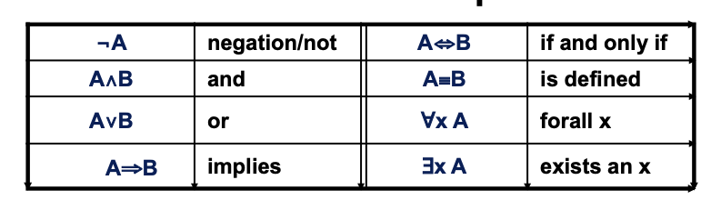

## What is Ontology

As a branch of philosophy, ontology is the science of what is, the kinds and structures of objects, properties, events, processes and relations in every area in reality. Ontology include set of _concepts_ and _relations_. It is knowledge about general propositions that are true of concepts. It means that ontology not concerned with indiviudal things (such as hotels, room) rather than focusing on the definitions of concepts. It is usually resulting in computer implementation. Ontology can be defined informally or using ideas from set theory and logic.

Ontology is useful because it can be used to communicated between _people_. Technical terms are often used with different meaning by different groups in an organization, e.g."Supplier". Ontology can be used to communicated between _computers_. e.g. &lt;cost&gt;£10&lt;/cost&gt; v.s. &lt;price&gt;£10&lt;price&gt;. Ontology can be used to communicated between _people and computers_, e.g. how to read friend (Ann, Bob). The main **benefit** of ontology is improving interoperatbility. Ontology can be drectly transferred from one software application to another without needing prior knowledge of eiter application. The whol progress is aotumatic and maintained the meaninig of all the data values transferred.

This is one of the **example**: a medical ontology. This ontology include Hierarchical organisation of _classes_ and different levels of _granularity_. The attributes (physical and material) distinguish the major branches of the exonomy.<br> 


## Ontological Modelling

Ontological modelling include **concepts, instances, relationships and Functions.** Concepts include class, category and type. The concrete entities(individual) can be instantiated a concept. Assertions about individuals would be considered part of knowledge base, not part of ontology. E.g. 
- Ontology Base: &forall;x x ∈ Female &rArr; x &notin; Male
- Knowledge Base: Ann ∈ Woman ∧ married (Ann, Joe)<br>

Relationships include N-ary [predicates](https://www.quora.com/What-is-an-ontological-predicate)(unary, binary, tenary, ...).
The unary predicates can be man(Adam) are typically modelled as Concepts: 
Man
Adam ∈ Man; Adam ∈ Male; Adam ∈ Human.
But the analysisi will often reduce relationship to be binary hasMonther(Adam, Ann). The Exception can be between(door, table, window). The functions are + - / &times;.

The **syntax** of ontology: the atomic formula in first order logic will be written _predicate(argument1, argument 2)_. x ∈ C will denote set membership. Let p and q be predicates, well-formed formulas include: &forall;x p(x), &forall;x p(x)&rArr;q(x). The quantifier&forall; may be dropped for legibility and x,y,z denote variables.



The basis of an ontology is the catgorisation of enetities into **classes**. subClassOf relates the subclass to the super class: subClassOf(SUBCLASS, SUPERCLASS). This is also known as is-a. subClassof is defined in terms of instance-of (type in RDF): type(a,C)≈a∈C, subClassOf(S, T) ⟺ (&forall;xtype(x,S)&rArr; type(x,T)）. The S and T are names of concepts which can be unary predicates: &forall;x S(x)&rArr;T(x). This also equal to subClassOf(S,T).

The **relations** in ontological modelllinsg incldue:
- Domain domain(P,C): P(x,y)⟹type(x,C) E.g. domain(hasMother, Human), adding domain (P,D) means all x lie in C ∩ D.
- Range range (P,C): P(x,y)⟹type(y,C)E.g. range(hasMother,Woman)


The **attribute relations** is a type of relation distinguished by its range.
- Attributes and values: Attributes are binary relations and they maybe ordered or part ordered. The range is a specified set of instances and it is transitive. e.g. small&lt;medium, medium&lt;large⟹small&lt;large.
- Attributes and Classes: attributes can be drawn from a set of discrete attribute value or from a continuous range (real number) e.g. Nominal and Ordinal. The attribute relations include binary, functional, and hierarchically organised.

There are different **types of Ontology**: Knowledge Representation, Upper-level, Generic and Application (Domain) Ontologies


```markdown
Question:
- ontology how to communication between computers (what is ontology)?
- What is the exception of the Ontology (relationships in ontological modelling)?
- what is the function of ontology (relationships in ontological modelling)
- raltion of onotological model: higher-arity, Cardinality
Next:
- find the example of four types of ontology
- how to create the one ontology by using any tools?
- how to do annotation on ontology?
- how to apply ontology in different technologies such as process mining?
```


